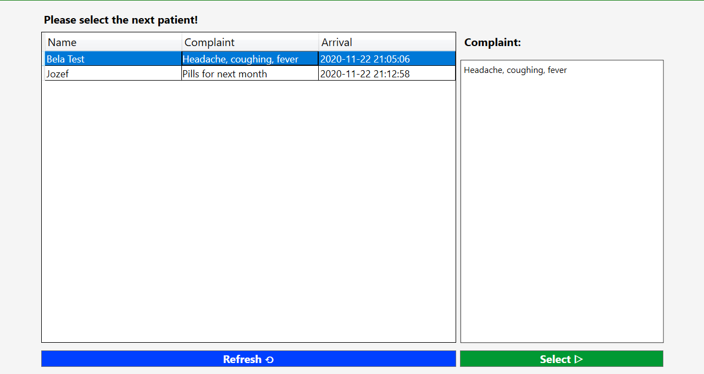
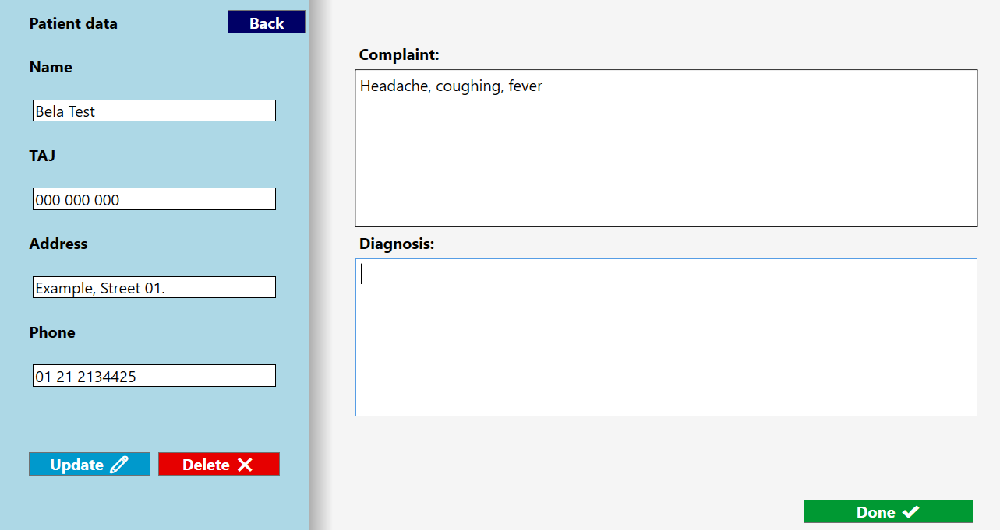

# doctorCSharp

#### C# Web API with 2 WPF client application.

## DoctorClient

[Github Pages](https://notusedusername.github.io/doctorCSharp/)

Select the next patient, and modify his/her profile, check the complaint and set up a diagnosis. The list is ordered by arrival.
If there are no patients in the waiting room currently, then the application will re-check it in every 5 seconds.
If a patient wants to visit another doctor from now, then you can delete all of his/her data with a single click!
(Well with 2, because you have to confirm this risky action.)

### List of the waiting patients

### Profile and diagnosis of the examined patient

----

## AssistantClient

List of patient with basic data.Register new patient and search by name or TAJ.Select the patient and send complaint to doctor.

### List of the waiting patients

### Register new patient

### List with registered patient

### Filter and select patient

### Send the complaint to doctor

-----

[Specification](https://github.com/arpadracz/ni2020osz/blob/master/Beadando_feladatok/KliensSzerver_Orvos.md)

[REST API](https://documenter.getpostman.com/view/9456191/TVev55CK)

[Trello](https://trello.com/b/WVdJnBiK/doctor-c)

-------

| Developers|
|------|
| Zsolt Varga|
| Norbert Tóth|
